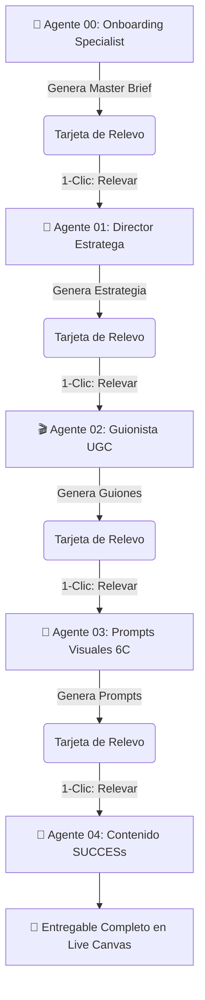

# 🔄 Orquestación Principal & Pipeline de Relevos (Handoff)

```mermaid
graph TD
    A["💬 Agente 00: Onboarding Specialist"] -->|"Genera Master Brief"| B("Tarjeta de Relevo")
    B -->|"1-Clic: Relevar"| C["🎯 Agente 01: Director Estratega"]
    C -->|"Genera Estrategia"| D("Tarjeta de Relevo")
    D -->|"1-Clic: Relevar"| E["🎬 Agente 02: Guionista UGC"]
    E -->|"Genera Guiones"| F("Tarjeta de Relevo")
    F -->|"1-Clic: Relevar"| G["🎨 Agente 03: Prompts Visuales 6C"]
    G -->|"Genera Prompts"| H("Tarjeta de Relevo")
    H -->|"1-Clic: Relevar"| I["🧲 Agente 04: Contenido SUCCESs"]
    I --> J["📁 Entregable Completo en Live Canvas"]
```
