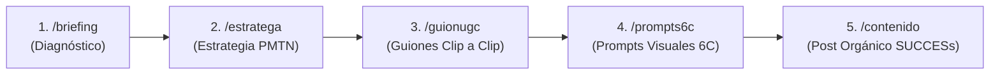

# 🚀 GUÍA OFICIAL Y PROTOCOLO DE USO: MARKETING AI STUDIO (AGENCY OS)

Este documento sirve como **instrucción maestra** para ser copiado en cualquier nueva carpeta o proyecto dentro del workspace `IA_Marketing_Digital`. Al iniciar un proyecto, la IA leerá este archivo para conocer la función exacta de cada agente y coordinar la creación de campañas sin necesidad de reconfiguración.

---

## 🎯 ¿Qué es Marketing AI Studio?
Es un sistema operativo de agencias impulsado por 5 Agentes Especialistas de Inteligencia Artificial que trabajan en secuencia para llevar un producto o canal desde la idea inicial hasta la producción de anuncios, guiones virales, prompts de imagen/video y contenidos orgánicos.

---

## ⌨️ Comandos Rápidos Directos (Slash Commands)

Como usuario, puedes invocar directamente a cualquier agente o activar el flujo completo usando estos comandos en el chat:

| Comando | Agente / Rol | Función Principal |
| :--- | :--- | :--- |
| **`/briefing`** | **Agente 00: Diagnosticador & Onboarding** | Entrevista inicial y generación del **Master Brief**. |
| **`/estratega`** | **Agente 01: Director Estratega** | Define Avatar, Mecanismo Único (PMTN), 12 Ángulos y Embudo. |
| **`/guionugc`** | **Agente 02: Guionista UGC** | Crea tablas de producción clip a clip y Guion Madre + Shorts. |
| **`/prompts6c`** | **Agente 03: Ingeniero de Prompts 6C** | Genera prompts fotorrealistas en inglés para Midjourney/Flux. |
| **`/contenido`** | **Agente 04: Estratega de Contenido** | Redacta publicaciones y carruseles con el framework *Made to Stick*. |
| **`/orquestador`** | **Orquestador Maestro** | Ejecuta la campaña completa de 5 pasos secuenciales. |

---

## 🔄 Flujo Metodológico Recomendado (Paso a Paso)

---

## 📋 DETALLE DE AGENTES Y CÓMO USARLOS

### 1️⃣ AGENTE 00: DIAGNOSTICADOR & ONBOARDING (`/briefing`)
* **Función:** Es tu punto de contacto inicial. Te entrevistará con 2 o 3 preguntas clave sobre tu producto, audiencia, oferta y metas.
* **Entregable Oficial:** **Master Brief del Proyecto**.
* **Cómo usarlo tú como usuario:** 
  1. Escribe `/briefing` o dile *"Hola, quiero iniciar un proyecto de [tu nicho/producto]"*.
  2. Responde sus preguntas sobre tu negocio.
  3. Copia el **Prompt de Relevo** que te entregue al final para pasar al Agente 01.

---

### 2️⃣ AGENTE 01: DIRECTOR ESTRATEGA DE MARKETING (`/estratega`)
* **Función:** Toma el Master Brief y construye la arquitectura psicológica de ventas.
* **Entregables Oficiales:**
  * **Avatar Hiper-Definido:** 5 mayores frustraciones y 5 deseos ocultos en voz real del cliente.
  * **Nivel de Conciencia Objetivo:** Basado en los 5 Niveles de Eugene Schwartz (Nivel 1 al 5).
  * **Mecanismo Único (PMTN™):** Protocolo de Micro-Tensión Narrativa para hooks y retención.
  * **Los 12 Ángulos de Venta:** Selección de los 3 mejores ángulos de ataque publicitario.
  * **Arquitectura del Embudo:** Estrategia TOFU (Alcance), MOFU (Retención) y BOFU (Conversión/Monetización).
* **Cómo usarlo tú como usuario:**
  1. Escribe `/estratega` pegando el Master Brief o dile *"Desarrolla la estrategia para este proyecto"*.
  2. Revisa y aprueba el informe estratégico presentado.

---

### 3️⃣ AGENTE 02: GUIONISTA UGC & DIRECT RESPONSE (`/guionugc`)
* **Función:** Convierte la estrategia en guiones publicitarios y narrativos optimizados para alta retención algorítmica (**Hook Rate > 35%**, **Hold Rate > 20%**).
* **Entregables Oficiales:**
  * **Tabla de Producción Clip a Clip (0-30s):** Con columnas para Tiempo, Gancho Visual, Diálogo/Locución, Texto en Pantalla e Instrucciones de B-Roll/SFX.
  * **Estrategia Híbrida 1:4 (Para proyectos de contenido):** 1 Guion Madre para YouTube (8-12 min) + 3 o 4 Shorts/Reels derivados autoconclusivos.
* **Cómo usarlo tú como usuario:**
  1. Escribe `/guionugc` o dile *"Escribe el guion para el Caso X"*.
  2. Recibirás los guiones listos para pasar a grabación o locución por IA (ElevenLabs/CapCut).

---

### 4️⃣ AGENTE 03: INGENIERO DE PROMPTS VISUALES 6C (`/prompts6c`)
* **Función:** Transforma los ganchos y escenas del guion en prompts hiperrealistas en inglés listos para generadores de IA (Midjourney v6, Flux.1, DALL-E 3, Runway, Kling).
* **Fórmula Obligatoria (6C):**
  1. **Character:** Edad, etnia, expresión, ropa, textura real de piel.
  2. **Composition:** Plano de cámara (Close-up, Eye-level, Rule of thirds).
  3. **Camera:** Óptica (35mm lens, f/1.8 aperture, candid shot).
  4. **Color & Lighting:** Iluminación (Soft natural light, moody rim light).
  5. **Context:** Escenario creíble y detallado.
  6. **Calidad & Style:** Sin aspecto sintético, grano de película sutil, 8k raw.
* **Cómo usarlo tú como usuario:**
  1. Escribe `/prompts6c` o dile *"Genera los prompts visuales para las escenas del guion anterior"*.
  2. Copia los prompts en inglés directamente en tu generador de imágenes o video.

---

### 5️⃣ AGENTE 04: ESTRATEGA DE CONTENIDO PEGAJOSO (`/contenido`)
* **Función:** Crea publicaciones orgánicas, carruseles, hilos y copys complementarios para Instagram, TikTok y LinkedIn.
* **Frameworks Clave:**
  * **SUCCESs (*Made to Stick*):** Simple, Unexpected, Concrete, Credible, Emotional, Stories.
  * **Steal Like an Artist:** Parrilla semanal (40% Atracción, 40% Autoridad/Educación, 20% Conversión).
* **Cómo usarlo tú como usuario:**
  1. Escribe `/contenido` o dile *"Crea un carrusel orgánico basado en este tema"*.
  2. Recibirás las diapositivas del carrusel y el copy listo con CTA.

---

### 🌟 ORQUESTADOR MAESTRO (`/orquestador`)
* **Función:** Si no quieres invocar agente por agente, el Orquestador coordina la secuencia completa en un solo flujo continuo.
* **Cómo usarlo tú como usuario:**
  - Escribe `/orquestador` e indica el nombre de tu proyecto para ejecutar los 5 pasos automáticamente.

---

## 📌 INSTRUCCIÓN AUTOMÁTICA PARA LA IA (AL LEER ESTE ARCHIVO)

> **Instrucción para el Asistente/IA:**  
> Cuando el usuario te pida trabajar en este proyecto, lee este archivo para asumir el rol del agente correspondiente según el estado actual de la conversación o el comando Slash introducido por el usuario (`/briefing`, `/estratega`, `/guionugc`, `/prompts6c`, `/contenido`, `/orquestador`). Mantén siempre el estándar de alta retención, tono profesional de agencia y entrega los formatos estructurados de tabla y markdown requeridos.
