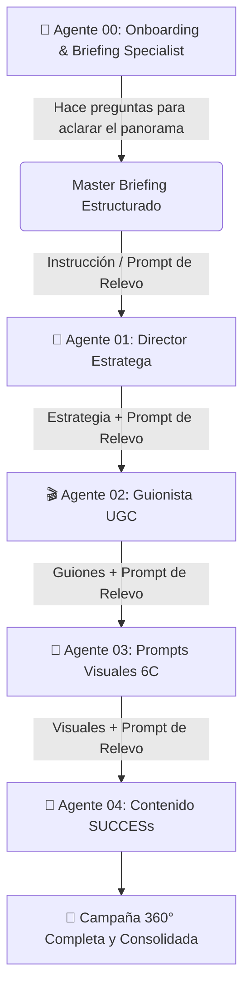

# 🚀 Plan Oficial de Evolución: Marketing AI Studio V3
**Fecha de Elaboración:** 24 de Septiembre, 2026  
**Objetivo:** Transformar la herramienta en una **Experiencia Conversacional de Agentes IA (Estilo Claude / ChatGPT Enterprise)** con **Agente Entrevistador de Onboarding**, **Relevo de Prompts entre Agentes (Handoff Pipeline)** e **Historial Persistente**.

---

## 💡 1. Tu Idea: El Flujo de Agencia Interactivo (Entrevistador + Relevos)

¡Tu propuesta es sencillamente **brillante** y representa la verdadera forma en que trabaja una agencia de marketing de alto nivel!

### 🔄 El Flujo de Relevos (Agente a Agente):

---

## 🤖 2. Detalle de los Agentes y la Dinámica de Trabajo

### 1️⃣ Agente 00: Account Executive & Onboarding Specialist (El Entrevistador)
* **Su Rol:** No te pide que llenes un formulario aburrido. Te hace una breve entrevista conversacional en el chat.
* **Dinámica:**
  1. Te pregunta: *"¡Hola! Cuéntame sobre tu marca o producto. ¿Qué vendes y a quién va dirigido?"*
  2. Evalúa lo que dijiste y hace repreguntas clave: *"¿Cuál es tu competidor principal?", "¿Qué precio o ticket tiene la oferta?", "¿Cuál es el principal dolor que resuelven?"*
  3. Cuando tiene toda la información clara, sintetiza el **Master Brief del Proyecto** y genera automáticamente las **Instrucciones / Prompt de Relevo** para el siguiente agente.

### 2️⃣ Agente 01: Director Estratega & Avatar (Schwartz & 12 Ángulos)
* Recibe el Master Brief del Agente 00.
* Te propone el nivel de conciencia, el mecanismo único y los 3 mejores ángulos de venta.
* Puedes chatear con él (*"Me gusta el Ángulo 2, pero hagámoslo más agresivo"*).
* Al estar listo, emite la **Instrucción de Relevo** para el Guionista UGC.

### 3️⃣ Agente 02: Guionista UGC Clip a Clip
* Recibe los ángulos aprobados del Agente 01.
* Escribe los guiones escena por escena (Voz en off, B-roll, hablando a cámara).
* Al finalizar, emite la **Instrucción de Relevo** para el Ingeniero de Prompts.

### 4️⃣ Agente 03: Ingeniero de Prompts Visuales 6C
* Recibe las escenas visuales del Agente 02.
* Genera los prompts hiperrealistas en inglés bajo la fórmula 6C para Midjourney / Flux.
* Emite la **Instrucción de Relevo** para el Creador de Contenido.

### 5️⃣ Agente 04: Creador de Contenido Pegajoso (Made to Stick)
* Recibe toda la narrativa acumulada y crea la parrilla orgánica de 7 días.

---

## 🛠️ 3. Arquitectura UX/UI V3 (Chat Conversacional)

1. **Barra Lateral Izquierda (Sidebar)**:
   * Historial de conversaciones guardadas por marca/cliente.
   * Selector de Agentes.

2. **Área Central (Chat Vivo Multi-Turno)**:
   * Conversación fluida en tiempo real.
   * **Tarjeta de Relevo (Handoff Card)**: Cuando un agente termina su trabajo, muestra un botón destacado:  
     👉 `[ Continuar con el Agente 01: Director Estratega ]`  
     *(Al presionar el botón, pasa todo el contexto acumulado sin que tengas que copiar y pegar nada)*.

3. **Panel Derecho (Canvas de Entregable)**:
   * Se va armando el documento consolidado en vivo a medida que apruebas el trabajo de cada agente.

---

## 📋 Resumen del Plan para Mañana
* **Crear Agente 00 (Onboarding Specialist)** en `.antigravity/agentes/00_onboarding_specialist.md`.
* **Implementar Motor de Chat Multi-Turno** en `engine.py` y `server.py`.
* **Rediseñar la Interfaz Web** con Chat, Tarjetas de Relevo y Canvas Dinámico.
