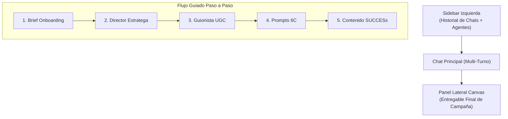

# 🚀 Plan Oficial de Evolución: Marketing AI Studio V3
**Fecha de Elaboración:** 24 de Septiembre, 2026  
**Objetivo:** Transformar la herramienta estática actual en una **Plataforma Conversacional de Agentes IA (Estilo Claude / ChatGPT Enterprise)** con **Historial Persistente**, **Multi-Turno** y **Flujo Guiado Paso a Paso (Agency OS Wizard)**.

---

## 📌 1. Diagnóstico del Estado Actual vs. Visión V3

### ❌ Estado Actual (V2 - Formulario Estático)
* Formulario único por agente con caja de texto estática.
* Una sola respuesta generada al fondo de la pantalla.
* Sin posibilidad de hacer preguntas de seguimiento o iterar propuestas.
* Sin historial de chat ni persistencia de la conversación.

### ✨ Visión V3 (Experiencia Conversacional e Intuitiva)
1. **Chat Inteligente Multi-Turno**: Conversa libremente con cada agente. Haz repreguntas ("*Me gusta el ángulo 2, pero adapta el hook para un público más joven*", "*Genera 3 opciones más de llamado a la acción*").
2. **Historial de Conversaciones Persistente**: Cada cliente o proyecto guarda sus hilos de conversación en la barra lateral para retomar el trabajo en cualquier momento.
3. **Workflow Guiado Paso a Paso (Paso a Paso de Agencia)**:
   * **Paso 1:** Brief del Proyecto (Onboarding).
   * **Paso 2:** Diagnóstico con el Director Estratega.
   * **Paso 3:** Guiones UGC alimentados de la Estrategia.
   * **Paso 4:** Prompts Visuales 6C derivados de los Guiones.
   * **Paso 5:** Parrilla Made to Stick y Cierre de Campaña.
4. **Panel Split / Canvas**: Un panel lateral donde se consolida el documento final de la campaña mientras chateas.

---

## 🏗️ 2. Arquitectura de Interfaz UX/UI (Estilo Claude / ChatGPT)

### Componentes de la Interfaz:

1. **Barra Lateral Izquierda (Sidebar)**:
   * Botón `+ Nueva Campaña Guiada`.
   * **Sección Agentes Especialistas**: Acceso rápido para chatear con un agente específico.
   * **Sección Historial de Proyectos**: Lista de conversaciones anteriores ordenadas por fecha/marca.

2. **Área Central (Chat Vivo)**:
   * **Header Superior**: Barra de progreso con las 5 etapas del proyecto (`[1] Brief -> [2] Estrategia -> [3] UGC -> [4] Prompts -> [5] Publicación`).
   * **Cuerpo de Mensajes**: Burbujas de chat estilizadas (Markdown rico, código copiable, tablas, respuestas en tiempo real).
   * **Sugerencias Rápidas (Chips)**: Botones interactivos sobre el campo de texto (*"Profundizar en Hook"*, *"Cambiar Tono a Humorístico"*, *"Crear variante B"*).
   * **Caja de Entrada (Prompt Bar)**: Input multinivel con soporte `Shift + Enter`, envío con `Enter` e indicador de token/modelo (`gemini-2.5-flash`).

3. **Panel Derecho (Canvas de Entregable)**:
   * Vista de documento dinámico que acumula la estrategia y guiones aprobados.
   * Botones de exportación en 1 clic: `Exportar PDF`, `Copiar Markdown`, `Descargar ZIP de Campaña`.

---

## 🛠️ 3. Plan de Implementación Técnico (Fases para Mañana)

### 🔹 Fase 1: Backend Conversacional y Persistencia (`engine.py` & `server.py`)
- [ ] Crear estructura de almacenamiento de sesiones en `D:/Archivos/proyectos/IA_Marketing_Digital/sessions/`.
- [ ] Implementar endpoint `/api/chat/send` que acepte el historial completo de mensajes (`messages: [{role: "user"|"assistant", content: "..."}]`).
- [ ] Conectar el modelo `gemini-2.5-flash` con contexto conversacional para responder repreguntas dentro del hilo.

### 🔹 Fase 2: Rediseño Completo del Frontend (`gui/index.html` & `gui/style.css`)
- [ ] Crear la interfaz de 3 columnas (Sidebar + Chat Area + Canvas Panel).
- [ ] Implementar motor de renderizado Markdown en vivo (`marked.js` + `highlight.js`).
- [ ] Añadir almacenamiento de hilos en `localStorage` sincronizado con el backend.

### 🔹 Fase 3: Wizard de Proyecto Paso a Paso (Paso a Paso de Agencia)
- [ ] Crear el modal/vista inicial de **Briefing** donde el usuario ingresa Marca, Producto y Objetivo.
- [ ] Implementar la transición de contexto automática entre agentes:
  * Al terminar la Estrategia (Agente 1), el botón *"Avanzar a Guiones UGC"* pasa automáticamente el informe generado al Agente 2.
  * Al terminar los Guiones (Agente 2), el botón *"Generar Prompts Visuales"* pasa los guiones al Agente 3.

---

## 📝 Resumen Ejecutivo
Con este plan, el **Marketing AI Studio** dejará de ser una herramienta de formularios aislados para convertirse en un **Copiloto de Agencia Inteligente**, donde interactúas en un chat continuo con tus agentes especialistas, revisas respuestas pasadas y construyes campañas completas en un flujo guiado súper intuitivo.

---
**Nota:** Este documento ha sido guardado oficialmente en el repositorio como hoja de ruta para la jornada de mañana.
