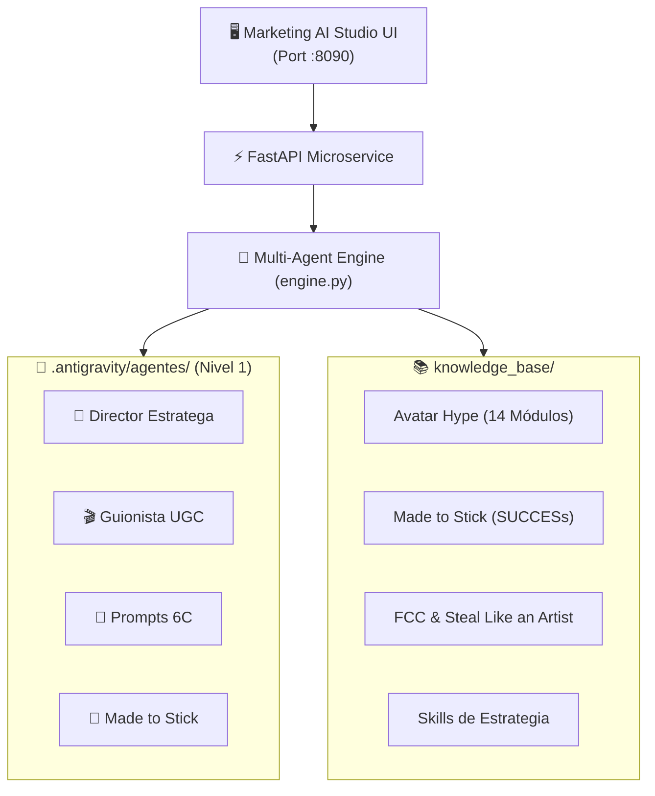

# 🚀 Marketing AI Studio (Agency OS v2.0)

> **Suite Privada de Inteligencia Artificial para Agencias de Marketing, Ventas y Direct Response.**
> Basada en el framework Antigravity v2.0 (Nivel 1: Manifiestos de Roles + Nivel 2: Subagentes Autónomos en Paralelo + Nivel 3: Microservicio Docker).

---

## 🌟 Características Principales

- **🎯 01. Director Estratega & Avatar**: Diagnóstico profundo de Buyer Persona, 5 Niveles de Consciencia de Eugene Schwartz, 12 Ángulos de Ataque y Mecanismo Único.
- **🎬 02. Guionista UGC Clip a Clip**: Guiones audiovisuales de respuesta directa tabla por tabla (Voz en off, Hablando a cámara, Podcast, Dualcast, Skit) con B-Roll y hooks visuales.
- **🎨 03. Ingeniero de Prompts Visuales 6C**: Prompts hiperrealistas en inglés estructurados con el estándar 6C (*Context, Character, Camera, Composition, Color/Light, Consistency*) para Midjourney, Flux y HeyGen.
- **🧲 04. Creador de Contenido Made to Stick**: Parrillas orgánicas y posts de autoridad aplicando el modelo **SUCCESs** (*Simple, Unexpected, Concrete, Credible, Emotional, Story*).
- **⚡ Campaña 360° en Paralelo (Nivel 2)**: Generación simultánea de los 4 entregables en segundo plano con persistencia organizada en `/campaigns`.

---

## 🏗️ Arquitectura del Sistema



---

## 🚀 Despliegue Rápido con Docker

Solo necesitas clonar el repositorio y ejecutar:

```bash
docker compose up -d --build
```

Abre tu navegador en:
👉 **`http://localhost:8090`**

---

## 💻 Ejecución Local en Python

Si prefieres ejecutar sin Docker:

1. **Instalar dependencias:**
   ```bash
   pip install -r requirements.txt pywebview
   ```

2. **Lanzar la aplicación de escritorio:**
   ```bash
   python app_desktop.py
   ```
   *(O ejecuta `run_desktop.bat` en Windows).*

---

## 📁 Estructura del Repositorio

```text
IA_Marketing_Digital/
├── .antigravity/
│   └── agentes/             # Manifiestos de roles y reglas (Nivel 1)
├── knowledge_base/          # Libros, cursos y transcripciones sincronizadas
├── campaigns/               # Persistencia de campañas 360° generadas
├── gui/                     # Interfaz web / desktop (Dark Glassmorphism)
│   └── index.html
├── engine.py                # Orquestador multi-agente y subagentes paralelos
├── server.py                # Microservicio REST FastAPI (:8090)
├── app_desktop.py           # Lanzador nativo de escritorio (PyWebView)
├── Dockerfile               # Imagen Docker optimizada
├── docker-compose.yml       # Mapeo de volúmenes en vivo
└── requirements.txt         # Dependencias de Python
```
